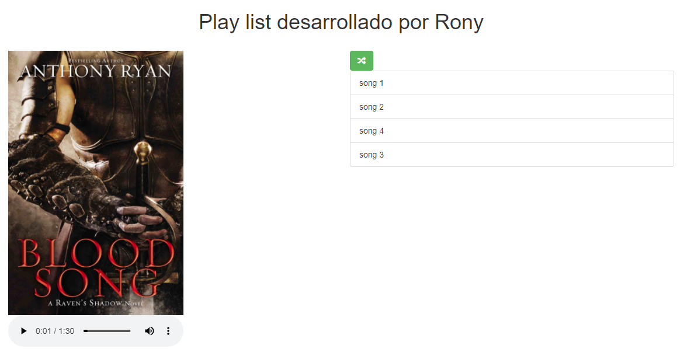
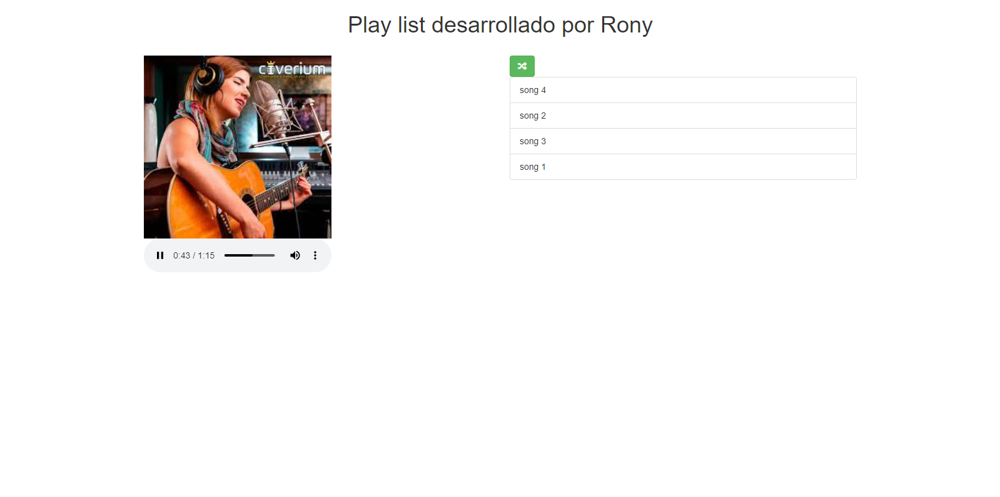

# Playlist Javascript

    
    
    
    

Este es un pequeño proyecto de una playlist musical programador con Javascript. 
Tiene como objetivo la práctica de conocimientos básicos en html, css y javascript.

# Herramientas utilizadas

* Javascript
* HTML5
* CSS3
* Bootstrap 3

# Funcionalidad

1. Listar canciones a partir de un archivo JSON
1. Reproducir canción seleccionada
1. Mostrar y cambiar portada de la canción seleccionada.
1. Cambiar de música al terminar una canción.
1. Botón que permita reproducir de manera aleatoria.

# Pantallas
## Página principal

## Lista de canciones aleatoria al seleccionar la opción shuffle
